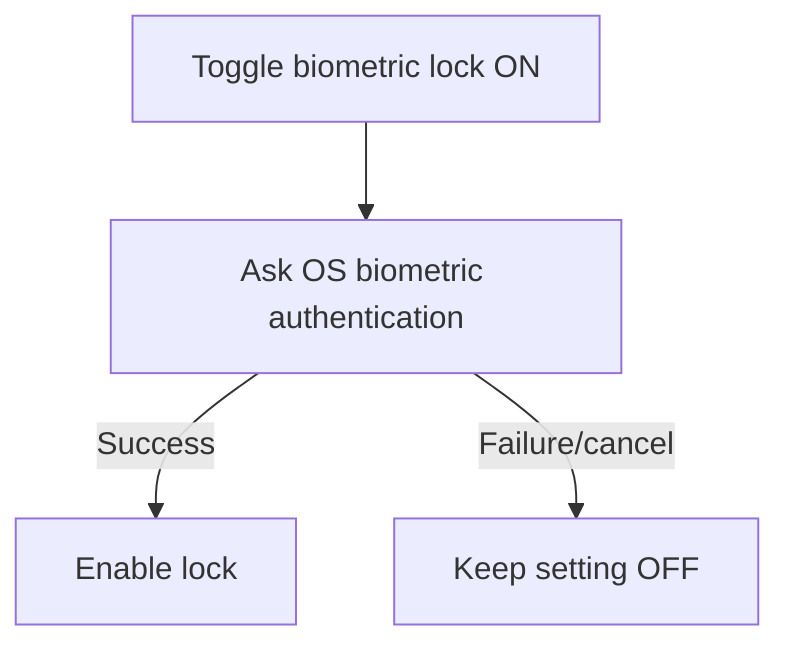

# TriggerNote UX Rework — Delivery Specification

**Repository:** `slawinski/glock-log`  
**Scope:** Focused UX/layout improvements only  
**Platform:** React Native / Expo

This specification intentionally covers only:

1. Home screen list-item layout
2. Add/Edit form layout
3. Details screen layout
4. Missing empty states
5. Touch targets
6. Zero-stock ammunition
7. Numeric input behavior
8. Error behavior
9. Sticky action bar and primary actions
10. Unsaved changes
11. Biometric lock
12. CRT overlay Settings toggle — no visual or behavioral changes to the existing effect

---

# 1. Home screen — list item layout

## Goal

Make every list row easy to scan in under a second.

The primary information should be:

- **what the item is**
- its most useful secondary metadata
- one important quantitative state

The current design should avoid layouts where the record name gets only half the available width while a number occupies the other half.

## 1.1 Firearm list item

### Recommended layout

```text
┌─────────────────────────────────────────┐
│ ┌──────┐  Glock 19 Gen 5                │
│ │photo │  9×19 mm                        │
│ └──────┘  2,450 rounds fired             │
│           Added 12 Aug 2026              │
└─────────────────────────────────────────┘
```

### Without photo

```text
┌─────────────────────────────────────────┐
│ Glock 19 Gen 5                         › │
│ 9×19 mm • 2,450 rounds fired             │
│ Added 12 Aug 2026                        │
└─────────────────────────────────────────┘
```

### Rules

- Firearm name gets the full remaining width.
- Allow the name to wrap to **2 lines** before truncating.
- Caliber and round count are secondary.
- Added/purchase date is tertiary.
- Do not split the row into equal-width left/right columns.
- The entire row is tappable.
- If photo exists:
  - recommended thumbnail: **56 × 56**
  - rounded corners: **8**
  - `resizeMode="cover"`
- Internal row padding:
  - horizontal: **16**
  - vertical: **12–14**
- Gap between thumbnail and text: **12**
- Minimum row height without photo: **72**
- Minimum row height with photo: **80**

## 1.2 Ammunition list item

### Recommended layout

```text
┌─────────────────────────────────────────┐
│ Federal American Eagle                  │
│ 9 mm • 124 gr FMJ                       │
│ 420 rounds remaining                    │
└─────────────────────────────────────────┘
```

Optional price metadata:

```text
Federal American Eagle
9 mm • 124 gr FMJ
420 rounds • 1.25 PLN / round
```

### Rules

- Brand/product identity is the first line.
- Caliber and ammunition variant are second-line metadata.
- Quantity is visually stronger than dates/prices.
- Do not put quantity in a separate 50%-width column.
- Depleted ammo remains visible when the relevant filter is active.
- A depleted item should look like the same record type, not disabled UI.

Example:

```text
Sellier & Bellot
9 mm • 124 gr FMJ
0 rounds • Depleted
```

## 1.3 Range visit list item

### Recommended layout

```text
┌─────────────────────────────────────────┐
│ FSO Shooting Range                      │
│ 28 Aug 2026                             │
│ 150 rounds • Glock 19 Gen 5             │
└─────────────────────────────────────────┘
```

If multiple firearms were used:

```text
FSO Shooting Range
28 Aug 2026
320 rounds • 2 firearms
```

### Rules

- Location is the primary identifier.
- Date is secondary.
- Total rounds and firearm count are tertiary.
- Do not try to list every firearm on the Home row.
- Entire row is tappable.

## 1.4 Home list item acceptance criteria

- [ ] Primary identifier gets at least ~70% of usable row width.
- [ ] No equal-width left/right information split.
- [ ] Primary label may wrap to 2 lines.
- [ ] Entire row is tappable.
- [ ] Pressed state is visually obvious.
- [ ] No essential text is hidden behind icons or counters.
- [ ] Works with long firearm names, ammo brands and range names.
- [ ] Works at large OS text size without overlap.
- [ ] Row height grows naturally when text wraps.

---

# 2. Add/Edit forms — layout

## Goal

Forms should feel like ordinary, reliable mobile data-entry screens while retaining TriggerNote’s visual personality around them.

Do not structure them as a continuous terminal transcript.

Use:

```text
Screen title
Section heading
Field
Field
Field

Section heading
Field
Field

Sticky primary action
```

## 2.1 Firearm form

### Recommended structure

```text
New firearm

IDENTIFICATION

Model name *
┌───────────────────────────────────────┐
│ Glock 19 Gen 5                        │
└───────────────────────────────────────┘

Caliber *
┌───────────────────────────────────────┐
│ 9×19 mm                               │
└───────────────────────────────────────┘


SHOOTING

Initial rounds fired
┌───────────────────────────────────────┐
│ 0                                     │
└───────────────────────────────────────┘


PURCHASE

Amount paid
┌───────────────────────────────────────┐
│ 3200.00                          PLN  │
└───────────────────────────────────────┘

Purchase date
┌───────────────────────────────────────┐
│ 02 Sep 2026                         › │
└───────────────────────────────────────┘


PHOTOS

[ + Add photos ]

[ thumbnail ] [ thumbnail ]


NOTES

┌───────────────────────────────────────┐
│ Optional notes                        │
│                                       │
└───────────────────────────────────────┘
```

### Recommended order

1. Model name
2. Caliber
3. Initial rounds fired
4. Amount paid
5. Purchase date
6. Photos
7. Notes

Do not lead the form with optional photos.

## 2.2 Ammunition form

```text
New ammunition

AMMUNITION

Brand *
[ Federal                            ]

Caliber *
[ 9 mm                               ]

Variant / bullet details
[ 124 gr FMJ                         ]


INVENTORY

Quantity *
[ 500                         rounds ]


PURCHASE

Total paid
[ 625.00                        PLN  ]

Purchase date
[ 02 Sep 2026                    ›   ]


NOTES

[ Optional notes...                   ]
```

### Rules

- Quantity lives in its own inventory section.
- Always show the unit visually.
- Do not use placeholder-only labels.
- If price per round can be derived, calculate it instead of asking for redundant input.
- Editing a depleted ammo record must still work normally.

## 2.3 Range visit form

```text
New range visit

VISIT

Location *
[ FSO Shooting Range                  ]

Date *
[ 02 Sep 2026                      ›  ]


FIREARMS & ROUNDS

┌─────────────────────────────────────┐
│ Glock 19 Gen 5                     │
│ 9×19 mm                            │
│                                     │
│ Rounds fired                        │
│ [ 150 ]                             │
│                                     │
│ Ammunition                          │
│ Federal AE 124 gr                 › │
│ 420 available                       │
└─────────────────────────────────────┘

[ + Add firearm ]


SUMMARY

150 rounds
1 firearm

Ammo after save:
Federal AE 420 → 270


PHOTOS

[ + Add photos ]


NOTES

[ Optional notes...                   ]
```

### Rules

- Related fields are grouped visually.
- Each firearm used in a visit appears as a card/group.
- Ammo selection stays visually attached to that firearm.
- Show remaining inventory before save.
- If multiple firearms are added, stack the cards vertically.
- Avoid deeply nested card-on-card styling.

## 2.4 Form spacing

Recommended:

```text
Page horizontal padding        16
Top padding                    16
Section heading → first field  12
Field label → control           6–8
Field → next field             16
Section → section              28–32
Bottom content padding         sticky bar height + 24
```

Do not create double-padding by combining page padding and equally large card padding unless the card visually requires it.

---

# 3. Details screen — layout

## Goal

A details screen should answer:

1. What record is this?
2. What is its current/important state?
3. What metadata belongs to it?
4. What related activity exists?
5. What can I do next?

Do not present the entire record as one flat list of labels and values.

## 3.1 Firearm details

```text
Glock 19 Gen 5
9×19 mm

[ photo carousel ]

2,450
rounds fired


OVERVIEW

Purchased        04 Mar 2025
Amount paid      3,200 PLN
Added            04 Mar 2025


RECENT ACTIVITY

28 Aug 2026      150 rounds
12 Aug 2026      120 rounds
02 Aug 2026       90 rounds


NOTES

Primary training pistol.
...


[ Edit firearm ]


DANGER ZONE

Delete firearm
```

### Rules

- Name and caliber are at the top.
- Most useful numeric metric is prominent.
- Metadata appears in grouped key/value rows.
- Recent activity is visually separate.
- Edit is the main action.
- Delete is separate from ordinary actions and placed at the bottom.

## 3.2 Ammunition details

```text
Federal American Eagle
9 mm • 124 gr FMJ

420
rounds remaining


INVENTORY

Initial quantity      500
Remaining             420
Used                    80


PURCHASE

Total paid          625 PLN
Price / round      1.25 PLN
Purchase date      12 Aug 2026


USAGE

28 Aug 2026          80 rounds
FSO Shooting Range


[ Edit ammunition ]


DANGER ZONE

Delete ammunition
```

For depleted ammo:

```text
0
rounds remaining

Status
Depleted
```

Do not hide the record or collapse useful purchase history.

## 3.3 Range visit details

```text
FSO Shooting Range
28 Aug 2026

150
rounds fired


FIREARMS

Glock 19 Gen 5
150 rounds

Ammunition
Federal AE 124 gr
150 rounds consumed


PHOTOS

[ image ] [ image ]


NOTES

...


[ Edit visit ]


DANGER ZONE

Delete visit
```

## 3.4 Details acceptance criteria

- [ ] Primary identity is immediately visible.
- [ ] Key metric appears above metadata.
- [ ] Metadata is grouped by meaning.
- [ ] Related activity is distinct from static metadata.
- [ ] Edit is the primary action.
- [ ] Delete is visually separated as destructive.
- [ ] Long values wrap instead of truncating aggressively.
- [ ] Details screens remain readable at large text sizes.

---

# 4. Missing empty states

Every collection screen must have a designed empty state.

An empty state should contain:

1. what is empty;
2. why this matters;
3. the next useful action.

## 4.1 Firearms

```text
        No firearms yet

Add your first firearm to start tracking
round counts, range visits and history.

        [ Add firearm ]
```

## 4.2 Ammunition

```text
      No ammunition in stock

Add ammunition to track purchases and
automatically deduct rounds after visits.

       [ Add ammunition ]
```

If depleted items exist:

```text
      No ammunition in stock

7 ammunition records are depleted.

[ Add ammunition ]   [ View depleted ]
```

## 4.3 Range visits

```text
       No range visits yet

Log a visit to track rounds fired and
update ammunition inventory.

        [ Log a visit ]
```

## 4.4 No results after filtering/search

This is not the same as a true empty database.

Example:

```text
No depleted ammunition

None of your ammunition records currently
have zero stock.

[ Show all ammunition ]
```

---

# 5. Touch targets

## Minimum sizes

- iOS: **44 × 44 pt**
- Android: target **48 × 48 dp**

Use 48 as the preferred cross-platform design target.

Applies to:

- list rows;
- back/menu buttons;
- tabs;
- photo remove buttons;
- date selectors;
- dropdown/select rows;
- checkboxes/toggles;
- biometric setting;
- icon-only controls;
- Add firearm / Add ammo actions.

## 5.1 Icon buttons

A small icon may visually be 20–24 px, but its hit area must remain at least 44–48.

Example:

```text
visual icon:   24 × 24
hit area:      48 × 48
```

Do not require pixel-precise tapping.

## 5.2 List rows

Entire row is the target.

Bad:

```text
Glock 19 Gen 5                       [ tiny > ]
                                     ↑ only target
```

Correct:

```text
┌─────────────────────────────────────────┐
│ Glock 19 Gen 5                      ›   │
│ 9×19 mm • 2,450 rounds                  │
└─────────────────────────────────────────┘
↑ whole surface tappable
```

---

# 6. Zero-stock ammunition

## Requirement

`quantity === 0` must **not** mean “remove this item from the user interface.”

Zero stock is a meaningful inventory state.

The user may need to:

- identify what they previously purchased;
- reorder the same ammunition;
- review historical price;
- inspect where it was consumed;
- correct range-visit data;
- edit record metadata.

## 6.1 Recommended filtering

On the ammunition Home tab:

```text
[ In stock ]   [ Depleted ]   [ All ]
```

Default:

```text
In stock
```

This keeps the primary view clean without making history inaccessible.

If space is tight, use:

```text
Ammo                           Filter
In stock
```

and open a small sheet:

```text
Show ammunition

● In stock
○ Depleted
○ All
```

## 6.2 Depleted list row

```text
Federal American Eagle
9 mm • 124 gr FMJ
0 rounds • Depleted
```

Use lower visual emphasis, but do not make it look disabled.

It remains tappable.

## 6.3 Range visit behavior

If user selects ammo with insufficient stock:

```text
Available: 80 rounds
Entered:   120 rounds

You only have 80 rounds in inventory.

[ Change ammunition ]
[ Use external ammo for 40 rounds ]
```

Do not:
- silently create negative inventory;
- silently clamp to available stock;
- silently switch to another ammo record.

---

# 7. Numeric input rule

## Requirement

Keep numeric form values as **strings during editing**.

Parse to a number only when:

- validating final value;
- calculating derived data where safe;
- submitting/persisting.

## 7.1 Why

Immediate parsing breaks valid intermediate editing states.

Example:

```text
User intends: 12.50

Editing states:
""
"1"
"12"
"12."
"12.5"
"12.50"
```

If `"12."` is immediately parsed:

```text
parseFloat("12.") → 12
```

the app destroys the user's editing state.

## 7.2 Rule

Good:

```ts
const [amount, setAmount] = useState("")

onChangeText={setAmount}

const parsedAmount = Number(amount)
```

Not:

```ts
onChangeText={(value) => {
  setAmount(parseFloat(value))
}}
```

## 7.3 Applies to

- amount paid;
- ammunition quantity;
- initial round count;
- rounds fired;
- price;
- any decimal monetary field.

## 7.4 Additional behavior

- Use numeric keyboard where appropriate.
- Accept locale-relevant decimal separators if supported.
- Normalize only on blur/save if necessary.
- Empty string is a valid editing state.
- Preserve entered value when validation fails.

---

# 8. Error behavior

## Goal

Errors should be:

- local;
- specific;
- easy to recover from;
- announced accessibly.

## 8.1 Field error anatomy

```text
Amount paid
┌───────────────────────────────────────┐
│ 12..50                                │
└───────────────────────────────────────┘
Enter a valid amount.
```

### Rules

- Show the error directly under the relevant field.
- Do not duplicate the same error elsewhere on the screen.
- Keep the user's value.
- Error state must not rely on red color alone.
- Use border/icon/text treatment.
- When submitting:
  - focus the first invalid field;
  - scroll it into view;
  - announce the error to screen readers.

## 8.2 Error copy

Bad:

```text
INVALID VALUE
```

Better:

```text
Enter a valid amount.
```

Bad:

```text
FIELD REQUIRED
```

Better:

```text
Enter a model name.
```

Bad:

```text
INVALID QUANTITY
```

Better:

```text
Quantity must be greater than 0.
```

## 8.3 Form-level errors

Use a form-level message only for failures not tied to a single field.

Example:

```text
Couldn’t save this visit.
Please try again.
```

Do not replace field-level validation with one generic banner.

---

# 9. Sticky action bar and primary action

## Goal

The main action must remain easy to reach regardless of form length or device size.

## 9.1 Form sticky action bar

```text
┌───────────────────────────────────────┐
│                                       │
│ scrollable content                    │
│                                       │
├───────────────────────────────────────┤
│ [ Save firearm                      ] │
└───────────────────────────────────────┘
```

### Requirements

- Fixed to bottom of screen.
- Respects safe area.
- Content gets enough bottom padding not to be hidden.
- Keyboard-aware.
- At minimum, the action must remain reachable after keyboard dismissal.
- Prefer keeping it above the keyboard if implementation remains stable.
- Do not let a keyboard cover the final form fields permanently.

## 9.2 Primary actions

Use exactly one visually dominant primary action per screen.

Examples:

```text
Save firearm
Save ammunition
Save visit
Add firearm
Add ammunition
Log visit
Edit firearm
```

Avoid:

```text
[ CANCEL ] [ SAVE ] [ DELETE ]
```

with all three styled equally.

## 9.3 Secondary actions

- Back navigation usually replaces Cancel.
- Delete belongs in a Danger Zone or overflow action.
- Add another firearm inside a visit is a secondary action.
- Photo upload is secondary.

## 9.4 Save states

Normal:

```text
[ Save firearm ]
```

Saving:

```text
[ Saving… ]
```

Success:

- return to previous/details screen;
- optionally use subtle haptic confirmation;
- avoid blocking success modals for routine saves.

Failure:

```text
Couldn’t save firearm.
Try again.
```

Keep entered data intact.

---

# 10. Unsaved changes

## Requirement

If a user changes a form and then attempts to leave before saving, do not silently discard their work.

Applies to:

- Add firearm
- Edit firearm
- Add ammunition
- Edit ammunition
- Add range visit
- Edit range visit

## 10.1 Dirty-state rule

A form is dirty when its current values differ from initial values.

For Add screens:

```text
initial empty/default values
        ↓ any user change
dirty = true
```

For Edit screens:

```text
loaded record values
        ↓ any difference
dirty = true
```

After successful save:

```text
dirty = false
```

## 10.2 Confirmation

```text
Discard changes?

Your changes haven’t been saved.

[ Keep editing ]   [ Discard ]
```

### Rules

- `Keep editing` is the safe/default action.
- `Discard` is destructive.
- Trigger on:
  - back gesture;
  - navigation Back;
  - header close;
  - any action that leaves the screen.
- Do not trigger if nothing changed.

---

# 11. Biometric lock

## Settings layout

```text
SECURITY

Biometric lock                     [on]

Require Face ID or fingerprint when
opening TriggerNote.
```

### Rules

- Entire setting row is tappable.
- Toggle also remains directly operable.
- Show platform-appropriate language where possible:
  - Face ID
  - Touch ID
  - Fingerprint / biometrics

## 11.1 Enabling

Flow:



Do not show the setting as enabled before authentication succeeds.

## 11.2 Disabling

Recommended confirmation:

```text
Turn off biometric lock?

TriggerNote will open without biometric
authentication.

[ Cancel ]   [ Turn off ]
```

If the security model allows it, optionally require biometric confirmation before disabling.

## 11.3 App launch

When enabled:

```text
TriggerNote

Locked

[ Unlock with Face ID ]
```

If the OS prompts automatically, do not add unnecessary duplicate UI.

Fallback behavior should match the actual product security model; do not invent a passcode flow unless implemented.

---

# 12. CRT overlay — Settings toggle only

## Goal

Keep the existing CRT overlay **exactly as it is today**.

This work item must not change:

- scanline appearance;
- noise;
- vignette;
- flicker;
- opacity;
- animation;
- layering;
- timing;
- intensity;
- Reduced Motion behavior;
- rendering implementation;
- any other visual or behavioral characteristic of the current CRT effect.

The only requested change is to let the user turn the existing CRT overlay on or off from Settings.

## 12.1 Settings toggle

Add:

```text
APPEARANCE

CRT effect                         [on]

Show or hide the CRT screen effect.
```

### Behavior

- Default value: **ON**, preserving the current app experience.
- `ON` renders the existing CRT overlay with its current implementation unchanged.
- `OFF` does not render/show the CRT overlay.
- Persist the preference locally.
- Apply the change immediately; no app restart required.
- The preference applies app-wide.
- Do not introduce alternative CRT styles, intensity controls, Reduced Motion changes, or effect variants as part of this work.

### State model

```text
CRT setting ON
        │
        ▼
Use current CRT overlay exactly as implemented today

CRT setting OFF
        │
        ▼
Do not display the CRT overlay
```

## 12.2 Acceptance criteria

- [ ] Settings contains a `CRT effect` toggle.
- [ ] Toggle defaults to ON for users without a stored preference.
- [ ] OFF hides the CRT overlay.
- [ ] ON restores the existing CRT overlay.
- [ ] Preference persists between app launches.
- [ ] Changing the setting takes effect immediately.
- [ ] The existing CRT effect looks and behaves identically when enabled.
- [ ] No CRT styling, animation, opacity, layering, timing or accessibility behavior is modified.

---

# 13. Delivery priority

## P0

| ID | Item |
|---|---|
| UX-01 | Home list-item layout |
| UX-02 | Add/Edit form layout |
| UX-03 | Details screen layout |
| UX-04 | Touch targets |
| UX-05 | Numeric input rule |
| UX-06 | Error behavior |
| UX-07 | Sticky action bar / primary action |
| UX-08 | Unsaved changes |

## P1

| ID | Item |
|---|---|
| UX-09 | Empty states |
| UX-10 | Zero-stock ammo |
| UX-11 | Biometric lock UI/flow |
| UX-12 | Add CRT overlay on/off toggle in Settings; leave existing CRT effect unchanged |

---

# 14. Final acceptance checklist

## Home

- [ ] Firearm names are not constrained to half-width.
- [ ] Ammo names are not constrained to half-width.
- [ ] Visit location is visually primary.
- [ ] Long names wrap safely.
- [ ] Entire list row is tappable.

## Add/Edit

- [ ] Fields are grouped into logical sections.
- [ ] Photos do not lead the firearm form.
- [ ] Sticky Save remains easy to reach.
- [ ] Numeric values remain strings while editing.
- [ ] Validation preserves entered data.
- [ ] First invalid field is focused after submit.
- [ ] Leaving a dirty form triggers confirmation.

## Details

- [ ] Record identity is visible immediately.
- [ ] Key metric is visually prominent.
- [ ] Metadata is grouped.
- [ ] Edit is the primary action.
- [ ] Delete is separated as destructive.

## Empty states

- [ ] Firearms empty state exists.
- [ ] Ammunition empty state exists.
- [ ] Visits empty state exists.
- [ ] Filtered/no-results state is distinct from true empty state.

## Ammo

- [ ] Zero-stock items remain accessible.
- [ ] User can filter In stock / Depleted / All.
- [ ] Depleted records remain tappable.
- [ ] Range visits cannot silently produce negative inventory.

## Touch

- [ ] All core controls meet 44–48 minimum target size.
- [ ] Icon-only controls have expanded hit areas.
- [ ] Entire navigational rows are tappable.

## Biometric lock

- [ ] Enable only after successful biometric authentication.
- [ ] Disable flow is explicit.
- [ ] Settings copy clearly explains behavior.

## CRT

- [ ] Settings contains a CRT effect toggle.
- [ ] Toggle defaults to ON when no preference exists.
- [ ] Preference persists.
- [ ] OFF hides the overlay.
- [ ] ON restores the current overlay.
- [ ] Existing CRT visuals and behavior are unchanged when enabled.
